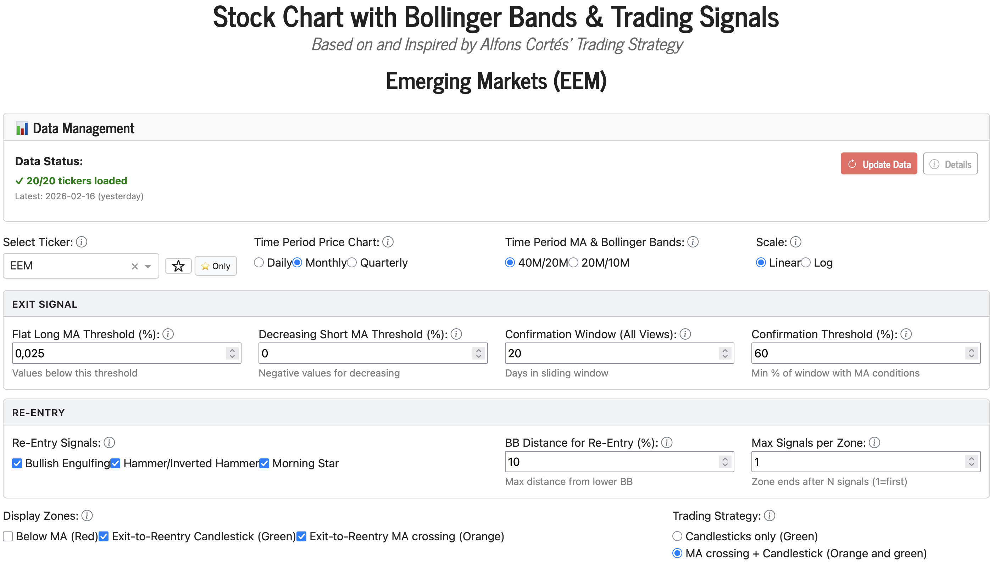
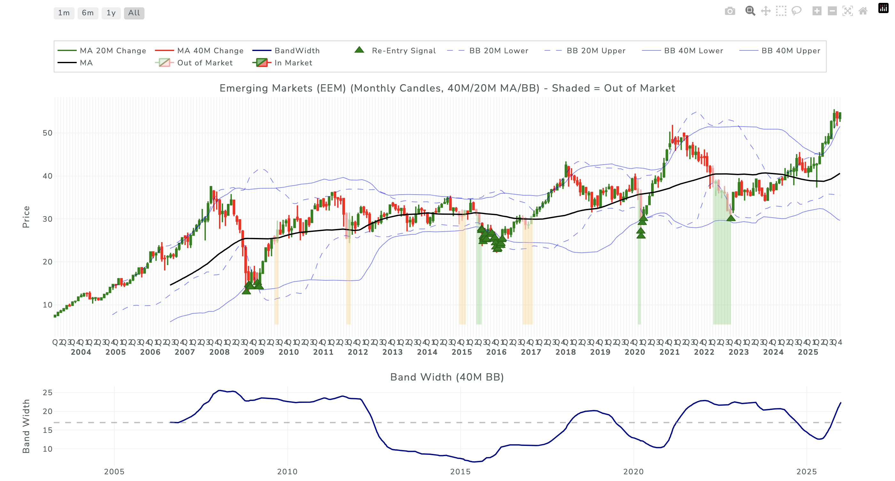
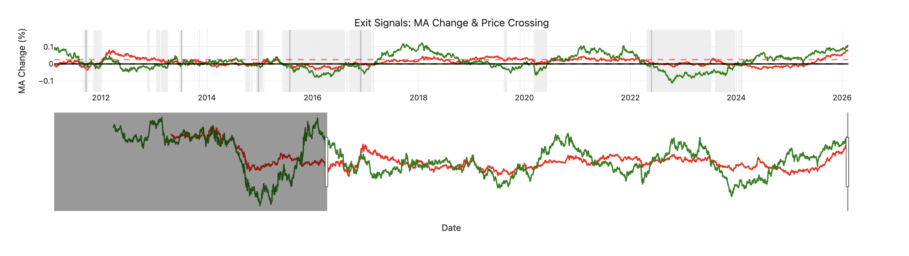
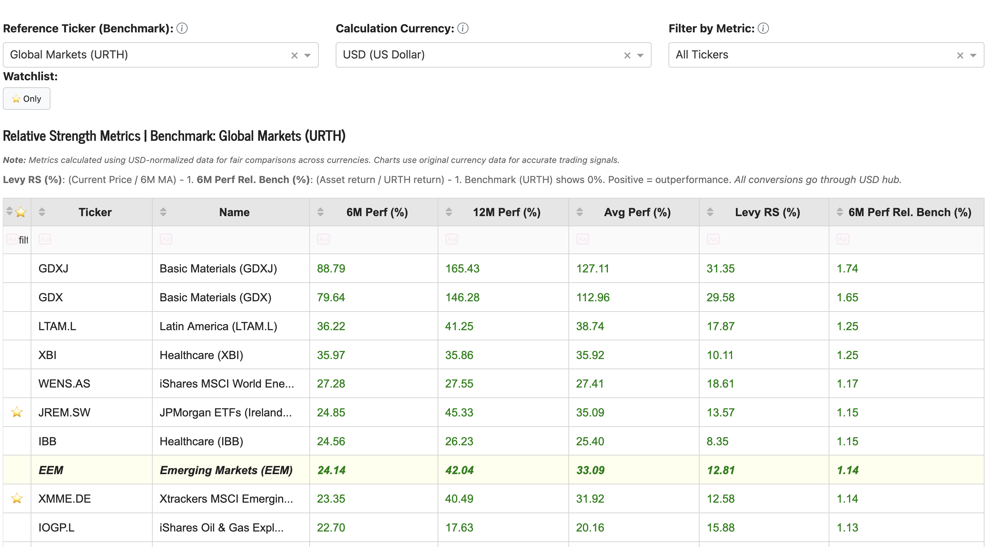

# Bollinger Bands Trading Application

## Overview

This application implements a systematic trading strategy based on the methodology developed by financial analyst Cortés. The strategy combines technical analysis with momentum-based sector selection to identify optimal entry and exit points for sector ETF investments.

## Strategic Philosophy

The Cortés trading methodology is built on two fundamental principles:

### 1. Momentum-Based Sector Selection

**Core Principle**: Invest only in sectors or regions that demonstrate superior momentum relative to the broad market.

**Rationale**:  
According to Cortés, there is no advantage in holding positions in sectors that underperform the broader market. By focusing capital on the strongest performers, investors can enhance returns while managing risk through selective exposure.

**Implementation**:  
The application provides a **Relative Strength Analysis** table that compares momentum metrics across multiple ETFs representing different sectors and regions:

- **6-Month Performance**: Recent momentum indicator
- **12-Month Performance**: Longer-term trend confirmation
- **Average Performance**: Combined momentum signal
- **Levy Relative Strength**: Comparative strength metric

**Usage**:  
Select tickers that show positive momentum and rank highest in relative performance. Avoid or exit positions in sectors showing negative momentum or underperformance.

### 2. Disciplined Exit and Re-Entry Signals

**Core Principle**: Preserve capital during unfavorable market conditions by moving to cash when technical conditions deteriorate, then re-enter when conditions improve.

**Exit Signal Philosophy**:  
The strategy generates exit signals when:
1. Price crosses below the long-term moving average
2. The long-term moving average becomes flat or declining (momentum loss)
3. The short-term moving average is decreasing (near-term weakness)

These combined conditions indicate that both long-term and short-term momentum have weakened, suggesting increased risk and the need to preserve capital.

**Re-Entry Signal Philosophy**:  
The strategy identifies re-entry opportunities through:
1. **Candlestick Reversal Patterns**: Strong visual indicators of potential trend reversal
2. **Price Position**: Near lower Bollinger Band (oversold conditions)
3. **Price Recovery**: Crossing back above moving average (momentum return)

Re-entry signals indicate that the asset has found support and may be resuming its upward trend.

## Key Features

### Technical Analysis Components

**Bollinger Bands**:
- Dual timeframe analysis (40M/20M or 20M/10M)
- Volatility-based support and resistance levels
- Band width indicator for volatility assessment

**Moving Averages**:
- Long-term trend identification (840 or 420 days)
- Short-term momentum tracking (420 or 210 days)
- Rate of change analysis for both averages

**Candlestick Pattern Recognition**:
- Bullish Engulfing
- Hammer and Inverted Hammer
- Morning Star
- Automatic pattern detection on multiple timeframes

### Data Management

**Smart Caching System**:
- Local data storage for fast application loading (10-30x faster after initial setup)
- Incremental updates download only missing dates
- Supports unlimited historical depth

**Multi-Timeframe Analysis**:
- Daily candlesticks for precise timing
- Monthly aggregation for trend clarity
- Quarterly view for long-term perspective

**Multiple Tickers**:
- Pre-configured with 9 sector and regional ETFs
- Easy addition of custom tickers via YAML configuration
- Parallel data management for all tickers

### Visual Analysis Tools

**Interactive Charts**:
- Candlestick price display with multiple timeframes
- Dual Bollinger Band visualization
- Moving average overlays
- Band width indicator

**Trading Zones**:
- Red zones: Price below moving average
- Green zones: Exit to candlestick re-entry (out of market)
- Orange zones: Exit to MA crossing re-entry (alternative timing)
- Clear visual distinction between in-market and cash positions

**Relative Strength Table**:
- Side-by-side momentum comparison
- Sortable and filterable metrics
- Interactive selection highlighting

## Application Screenshots

### Main Chart Interface





The main chart displays:
- Calibration options
- Candlestick price data (daily, monthly, or quarterly)
- Dual Bollinger Bands (40M/20M or 20M/10M)
- Long and short moving averages
- Trading zones (red: below MA, green: exit to re-entry, orange: MA crossing zones)
- Re-entry signals marked with green triangles
- Bollinger Band width to show volatility

### Exit Signal Detection



The bottom panel displays:
- Exit signal crossings with date markers
- Moving average condition status (flat/decreasing)
- Band width indicator showing volatility
- Real-time validation of signal conditions

### Relative Strength Analysis



The relative strength table shows:
- 6-month and 12-month performance metrics
- Average performance ranking
- Levy Relative Strength (RSL) indicator
- Sortable and filterable columns for quick analysis
- Performance Metrics in different currencies
- Highlighting of current selected ticker and benchmark


## Strategy Implementation

### The Complete Trading Cycle

#### Phase 1: Sector Selection (Initial Position)

1. **Analyze Relative Strength**:
   - Review the Relative Strength table
   - Identify tickers with high 6M, 12M and Levy RS (RSL)

2. **Select Top Performers**:
   - Choose sectors with strongest momentum
   - Ensure they outperform broad market benchmark
   - Consider diversification across different sectors
   - Do not hold positions in your portfolio that underperform the MSCI World Index, as it offers the best risk-adjusted returns (https://www.fuw.ch/der-msci-world-bleibt-der-leuchtturm-im-nebel-994955555043)

#### Phase 2: Position Monitoring (Hold Period)

1. **Track Price Action**:
   - Monitor price relative to moving average
   - Watch for exit signal conditions developing
   - Observe moving average slopes and crossovers

2. **Review Moving Average Status**:
   - Check "Exit Signals" panel (bottom chart)
   - Long MA should remain upward sloping (not flat)
   - Short MA should remain stable or rising

3. **Periodic Relative Strength Review**:
   - Compare current positions against other sectors
   - Consider rotating into stronger performers
   - Exit underperforming sectors even without exit signal

#### Phase 3: Exit Signal (Risk Management)

1. **Exit Signal Generation**:
   - System detects price crossing below moving average
   - Validates that long MA is flat (momentum loss)
   - Confirms short MA is decreasing (near-term weakness)
   - Validates conditions persist for significant portion of period

2. **Action Required**:
   - **Sell position** and move to cash
   - Exit is triggered to preserve capital
   - Wait for re-entry signal before returning

3. **Visual Confirmation**:
   - Chart shows shaded zone beginning (green or orange)
   - Candlesticks appear muted/faded (out of market)
   - Exit signal visible in bottom panel

#### Phase 4: Cash Period (Capital Preservation)

1. **Wait for Re-Entry**:
   - Monitor for candlestick reversal patterns as early signals
   - May watch for price approaching lower Bollinger Band to fine-tune your re-entry
   - Keep in mind that markets tend to be manic depressive
   - Consider choosing a different sector for re-entry. The broad market index often stabilizes first. Look for sectors that may gain during downturns, such as oil companies during the Dot-Com bust (https://medium.com/@redlotuscapitals/sectors-and-stocks-that-gained-during-the-dot-com-bust-8af2c64f1749)

2. **In Dubio pro Tauris**:
   - Do not wait too long to re-enter the market (https://themarket.ch/meinung/alfons-cortes-in-dubio-pro-tauris-ld.3769)
   - Be optimistic when others are not
   - Use candlestick reversal signals as guidance

#### Phase 5: Re-Entry Signal (Return to Market)

1. **Re-Entry Signal Generation**:
   - Candlestick pattern appears (Engulfing, Hammer, Morning Star)
   - Price is near lower Bollinger Band (oversold)
   - Or price crosses back above moving average (orange strategy, see below) when no candlestick signal appears

2. **Visual Confirmation**:
   - Green triangle marker on chart (re-entry signal)
   - Shaded zone ends
   - Candlesticks return to normal opacity

### Strategy Variations

**Conservative Approach** (Green Strategy):
- Use "Candlesticks only" strategy
- Wait for strong reversal patterns
- Accept potentially longer cash periods
- Lower false re-entry risk
- Better for risk-averse investors

**Aggressive Approach** (Orange Strategy):
- Use "MA crossing + Candlestick" strategy
- Re-enter as soon as price crosses above MA
- Shorter cash periods
- More time in market
- Higher potential returns but more whipsaws
- Better for active traders

**Hybrid Approach**:
- Use conservative parameters (strict exit conditions)
- Combined with aggressive re-entry (orange strategy)
- Protects capital well but re-enters quickly
- Balanced risk/reward profile

## Application Workflow

### Daily Workflow

1. **Update Data** (1-3 seconds):
   - Click "Update Data" button in application
   - Or run: `python manage_data.py update`

2. **Review Relative Strength**:
   - Check performance metrics for all tickers
   - Identify any significant changes in rankings
   - Note new leaders or declining sectors

3. **Analyze Charts**:
   - Review each position for signal status
   - Check if any new exit signals generated
   - Look for potential re-entry signals in cash positions

4. **Execute Trades**:
   - Place orders based on signals
   - Update position tracking
   - Document trades for record-keeping

### Weekly Workflow

1. **Deep Analysis**:
   - Review all tickers in detail
   - Analyze zone patterns and signal quality
   - Evaluate strategy effectiveness

2. **Parameter Review**:
   - Consider if current parameters are optimal
   - Adjust based on recent signal quality
   - Backtest parameter changes if making adjustments

3. **Sector Rotation**:
   - Identify emerging strong sectors
   - Consider rotating from weak to strong performers
   - Plan upcoming trades

### Monthly Workflow

1. **Performance Review**:
   - Calculate returns for the month
   - Compare to benchmark performance
   - Analyze winning and losing trades

2. **Strategy Evaluation**:
   - Review signal accuracy
   - Assess exit and re-entry timing
   - Consider strategy modifications

3. **Ticker Configuration**:
   - Add or remove tickers as needed
   - Update configuration in `config/tickers.yaml`
   - Rebuild data for new tickers

## Configuration

### Ticker Configuration

Edit `config/tickers.yaml` to customize ticker selection:

```yaml
tickers:
  - symbol: EEM
    name: "Emerging Markets (EEM)"
    enabled: true
  
  - symbol: SPY
    name: "S&P 500 ETF"
    enabled: true
```

### Parameter Tuning

Key parameters for strategy customization:

**Exit Sensitivity**:
- `Flat Long MA Threshold`: Lower = stricter exit conditions
- `Decreasing Short MA Threshold`: More negative = stricter
- `MA Condition Threshold`: Higher = require more confirmation

**Re-Entry Sensitivity**:
- `BB Distance`: Lower = require more oversold conditions
- `Max Re-Entry Signals`: Higher = require more confirmation
- `Trading Strategy`: Green (conservative) vs Orange (aggressive)

**View Selection**:
- `Daily`: Precise timing, more signals
- `Monthly`: Reduced noise, better for long-term
- `Quarterly`: Maximum trend clarity, fewest signals

See `docs/configuration_options.md` for detailed parameter explanations.

## Technical Requirements

### System Requirements

- Python 3.9 or higher
- 4 GB RAM minimum (8 GB recommended)
- 500 MB disk space for application
- 50-100 MB per ticker for cached data
- Internet connection for data updates

### Dependencies

Core dependencies automatically installed:
- pandas (data manipulation)
- yfinance (market data)
- plotly (interactive charts)
- dash (web application)
- dash-bootstrap-components (UI components)
- pyyaml (configuration management)

# Installation & Usage

## Clone Repository

```bash
# Clone repository
git clone <repository-url>
cd bollinger-bands

# Create virtual environment
python -m venv .venv
source .venv/bin/activate  # On macOS/Linux
# or
.venv\Scripts\activate  # On Windows

# Install in editable mode
pip install -e .
```

## Running the Dashboard

```bash
python -m bollinger_bands
```

**Or:**

```bash
python examples/app.py
```

**Access the application at:** `http://localhost:8050`

## First Run

On first run, the application will:
1. ✅ Check for `config/tickers.yaml` (included in repository)
2. ✅ Create `data/ohlc/` directory if needed
3. ✅ Create `data/currencies/` directory if needed
4. ✅ Download ticker data (if `auto_update_on_startup: true`)
5. ✅ Start the web server on `http://localhost:8050`

## Customization

Edit `config/tickers.yaml` to:
- Add or remove tickers
- Change data directory locations
- Enable/disable auto-update on startup
- Configure default date ranges

## Updating

```bash
cd bollinger-bands
git pull origin main
pip install -e .  # Reinstall if dependencies changed
```

## Troubleshooting

**"Module 'bollinger_bands' not found"**
```bash
# Make sure you're in the project directory
cd bollinger-bands

# Reinstall
pip install -e .
```

**"Config file not found"**
```bash
# Make sure config/tickers.yaml exists
ls config/tickers.yaml

# If missing, it should be in the repository
git pull
```

**"Port 8050 already in use"**
```bash
# Kill existing process
lsof -ti:8050 | xargs kill -9  # macOS/Linux
# OR
netstat -ano | findstr :8050  # Windows (find PID)
taskkill /PID <PID> /F  # Windows (kill process)
```


### Detailed Installation

See `docs/installation_guide.md` for comprehensive installation instructions, troubleshooting, and system-specific guidance.

## Usage

### Web Application

1. **Launch**: `python app.py` (from examples directory) or `python -m bollinger_bands`
2. **Select Ticker**: Choose from dropdown
3. **Configure View**: Select timeframe and parameters
4. **Analyze Signals**: Review charts and zones
5. **Check Relative Strength**: Identify top performers
6. **Execute Strategy**: Follow signals for trading decisions

### Command-Line Interface

```bash
# View data status
python manage_data.py info

# Update all tickers
python manage_data.py update

# Fetch specific ticker
python manage_data.py fetch SPY --start-date 2020-01-01

# View configuration
python manage_data.py config

# Clear cached data
python manage_data.py clear --all
```

### Programmatic API

```python
from bollinger_bands.data import DataFetcher, DataStorageManager

# Initialize
storage = DataStorageManager('config/tickers.yaml')
fetcher = DataFetcher(storage)

# Get data
data = fetcher.fetch_ohlc_data('EEM', '2020-01-01', '2024-12-31', use_cache=True)

# Analyze
from bollinger_bands.indicators import BollingerBands, MovingAverage

ma = MovingAverage(window=840)
bb = BollingerBands(window=840, num_std=2)

ma_values = ma.calculate(data)
bb_values = bb.calculate(data)
```

## Documentation

### Available Documentation

- **README.md** (this file): Overview and strategy summary
- **docs/installation_guide.md**: Detailed installation instructions
- **docs/configuration_options.md**: Complete parameter reference
- **docs/data_management.md**: Data system architecture and usage
- **config/tickers.yaml**: Ticker configuration file

### Getting Started

1. Read this README for strategy overview
2. Follow installation_guide.md for setup
3. Review configuration_options.md to understand parameters
4. Experiment with default settings
5. Optimize parameters based on your goals

## Performance Expectations

### Data Management

- **Initial load**: 30-60 seconds (downloads full history)
- **Daily updates**: 1-3 seconds (incremental updates)
- **Application startup**: 2-5 seconds (after initial load)

### Trading Performance

Performance depends heavily on:
- Ticker selection (sector strength)
- Parameter configuration
- Market conditions
- Execution timing

**Expected Behavior**:
- Fewer signals in trending markets (stay invested)
- More signals in volatile markets (preservation mode)
- Variable cash periods (depends on market recovery speed)

## Strategy Advantages

### Risk Management

1. **Capital Preservation**: Systematic exits during unfavorable conditions
2. **Momentum Focus**: Only invest in strong performers
3. **Objective Signals**: Removes emotional decision-making
4. **Volatility Awareness**: Bollinger Bands adapt to market conditions

### Opportunity Capture

1. **Systematic Re-Entry**: Clear signals for returning to market
2. **Oversold Detection**: Re-enter at favorable price levels
3. **Multiple Timeframes**: Flexibility in signal frequency
4. **Sector Rotation**: Identify best opportunities across markets

### Operational Efficiency

1. **Automated Analysis**: No manual calculations required
2. **Visual Clarity**: Clear signal indication on charts
3. **Historical Review**: Backtest strategies easily
4. **Data Management**: Fast updates and unlimited history

## Limitations and Considerations

### Market Conditions

- **Trending markets**: Fewer signals, longer hold periods
- **Volatile markets**: More signals, potential whipsaws
- **Sideways markets**: May generate false signals

### Transaction Costs

- Each signal requires a trade (entry or exit)
- Frequent signals increase costs
- Consider cost structure when setting parameters

### Lag Indicators

- Moving averages are lagging indicators
- Signals occur after trend changes begin
- Exact tops and bottoms will be missed

### Discretionary Judgment

- System provides signals, not guaranteed outcomes
- Users must still make final trading decisions
- Consider broader market context
- Adjust for personal risk tolerance

## Best Practices

### For New Users

1. **Start with defaults**: Use recommended parameter settings
2. **Paper trade first**: Observe signals before risking capital
3. **Understand signals**: Study historical patterns
4. **One ticker first**: Master the strategy on single position
5. **Document decisions**: Keep trade journal

### For Experienced Users

1. **Backtest parameters**: Optimize for your tickers
2. **Consider costs**: Adjust frequency vs transaction costs
3. **Combine approaches**: Use multiple strategies
4. **Monitor performance**: Track strategy effectiveness
5. **Stay disciplined**: Follow signals consistently

### Risk Management

1. **Position sizing**: Don't oversize any single position
2. **Diversification**: Hold multiple uncorrelated sectors
3. **Stop losses**: Consider adding stops beyond signal system
4. **Cash reserves**: Maintain emergency fund outside strategy
5. **Regular review**: Continuously evaluate and adjust

## Support and Resources

### Application Support

- Check documentation in `docs/` directory
- Review tooltips in application (hover over ⓘ icons)
- Test configurations with historical data
- Verify data integrity with `manage_data.py info`

### Strategy Questions

- Review Cortés methodology literature
- Backtest historical signals
- Start with paper trading
- Join trading communities for discussion

### Technical Issues

- See troubleshooting in installation_guide.md
- Verify Python and dependency versions
- Check data directory permissions
- Ensure configuration files are valid YAML

## Future Enhancements

Potential future additions:
- Automated email/SMS alerts for signals
- Performance tracking and analytics
- Backtesting framework with metrics
- Portfolio optimization tools
- Multi-asset class support
- Real-time data streaming
- Mobile application version

## License

MIT License

## Disclaimer

This application is for educational and informational purposes only. It does not constitute financial advice. Trading stocks and ETFs involves risk of loss. Past performance does not guarantee future results. Users should conduct their own research and consult with qualified financial advisors before making investment decisions.

<!--
## Contributing

[Add contribution guidelines if open source]

--->

## Acknowledgments

Strategy methodology based on work by financial analyst Cortés. Technical analysis concepts and Bollinger Bands developed by John Bollinger. Data provided by Yahoo Finance via yfinance library.

---

**Version**: 0.1.1  
**Last Updated**: 2026-01-03  
**Maintainer**: David Fischer
